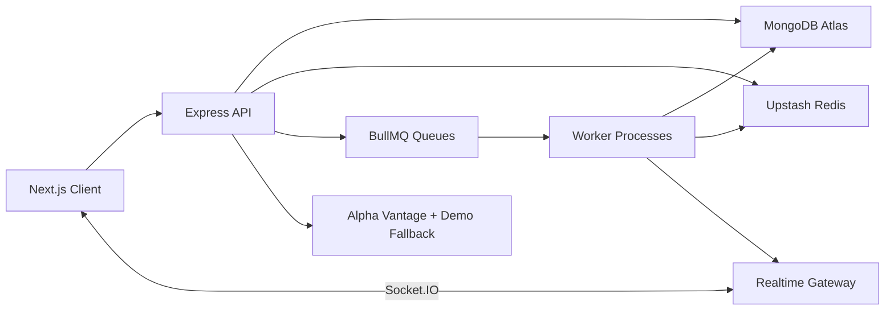
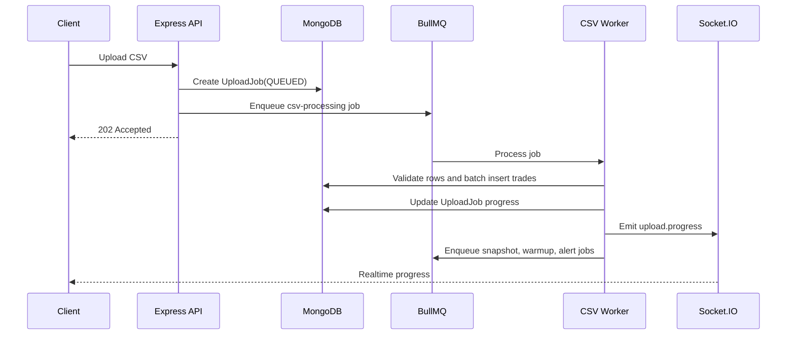
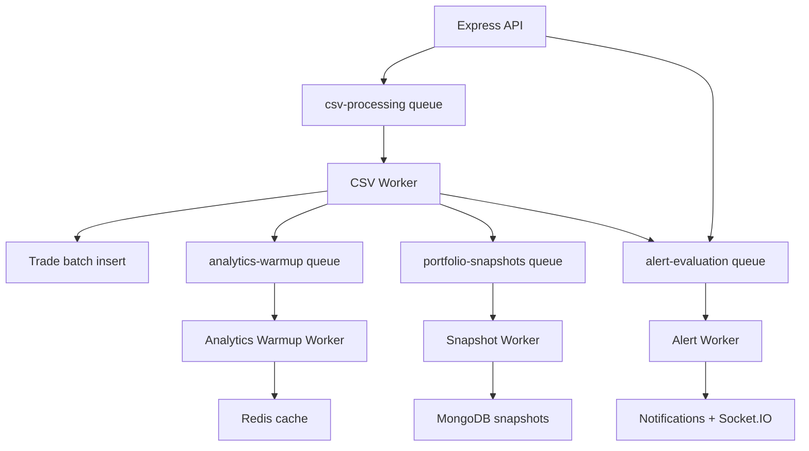
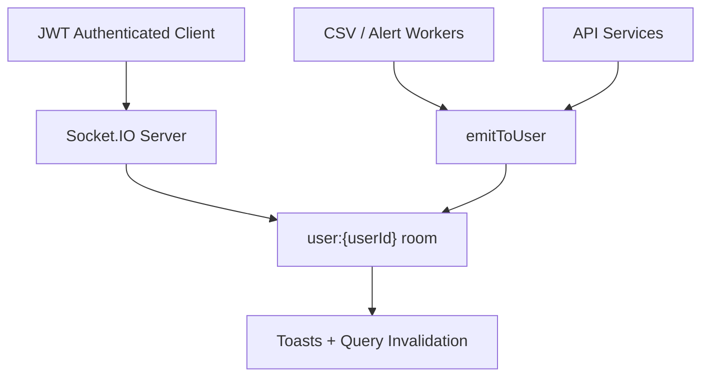
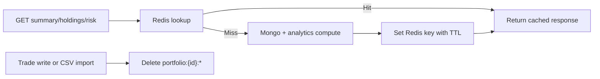
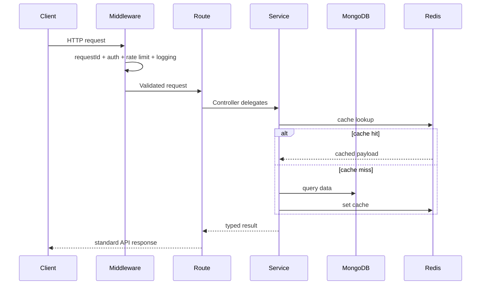

# RiskLens

RiskLens is a full-stack TypeScript SaaS platform for portfolio analytics, trade ingestion, risk monitoring, realtime notifications, and operational metrics. It is intentionally built as a backend-heavy MERN/Next.js project with enough quantitative analytics to be credible without becoming a trading bot.

## Problem Statement

Investors and analysts often track trades in spreadsheets, then manually calculate holdings, P&L, allocation, and risk. RiskLens turns trade history into a live analytics workspace with background CSV ingestion, cached portfolio summaries, risk alerts, historical snapshots, and websocket notifications.

## Tech Stack

- Frontend: Next.js App Router, TypeScript, Tailwind CSS, Radix primitives, TanStack Query, React Hook Form, Zod, Recharts, Lucide React
- Backend: Node.js, Express, TypeScript, MongoDB, Mongoose, JWT, bcrypt, Zod
- Async: BullMQ workers backed by Redis
- Realtime: Socket.IO
- Observability: Pino structured logs, request IDs, latency metrics, queue metrics, cache hit/miss counters
- Deployment targets: Vercel, Render/Koyeb, MongoDB Atlas, Upstash Redis

## Feature List

- Secure register/login/me authentication
- Portfolio CRUD with ownership checks, pagination, filtering, and sorting
- Manual trade creation, update, delete, listing, and oversell prevention
- Async CSV trade upload with row-level validation, partial failures, worker retries, and progress updates
- Holdings, average cost, realized P&L, unrealized P&L, market value, and allocation
- Portfolio summary, returns, P&L series, and risk analytics
- Risk metrics: volatility, annualized volatility, Sharpe ratio, max drawdown, historical VaR 95, concentration risk, risk score
- Configurable alerts for daily loss, drawdown, concentration, and volatility
- Realtime notifications and activity feed
- Daily portfolio snapshots and analytics cache warmup workers
- Backtesting for buy-and-hold and moving-average crossover
- Admin metrics endpoint for API, queue, cache, alert, upload, and notification health

## System Architecture



## Backend Architecture

The backend is a modular monolith under `server/src/modules`. Each domain has controller, service, routes, validation, and model boundaries where needed.

Important modules:

- `auth`: JWT authentication, bcrypt hashing, secure validation
- `portfolio`: ownership-scoped portfolio CRUD
- `trades`: trade ledger, pagination, oversell prevention
- `uploads`: async CSV upload job creation and polling
- `analytics`: holdings, summary, returns, risk, market data, caching
- `alerts`: alert CRUD and evaluation engine
- `notifications`: realtime notification lifecycle
- `snapshots`: daily portfolio history
- `backtests`: simple quant strategy evaluation
- `admin`: operational metrics

## Queue Architecture



Queues:

- `csv-processing`
- `alert-evaluation`
- `portfolio-snapshots`
- `analytics-warmup`

Jobs use retries, exponential backoff, completion/failure retention, worker logging, and progress updates.

## Worker Architecture



## Realtime Architecture



Realtime events include:

- `notification.created`
- `notification.read`
- `upload.queued`
- `upload.progress`

## Redis Caching Strategy



RiskLens uses cache-aside caching for:

- portfolio summaries
- holdings
- risk calculations
- returns
- market data

The default analytics TTL is 45 seconds. Cache keys are invalidated when trades change or CSV imports complete.

## Observability Strategy

Every request gets an `x-request-id`. Logs are structured with Pino and include request ID, user ID, route, latency, cache hit/miss state, queue job IDs, and worker failure context.

Tracked metrics include:

- average API latency
- p95 API latency
- cache hit ratio
- queue job counts
- failed uploads
- active alerts
- unread notifications
- websocket connections

Admin API:

```http
GET /api/v1/admin/metrics
```

## Request Lifecycle



## Database Schema Summary

Models:

- `User`: name, email, passwordHash, role
- `Portfolio`: userId, name, description, baseCurrency, isArchived
- `Trade`: userId, portfolioId, symbol, side, quantity, price, fees, tradeDate, source, idempotencyKey
- `PortfolioSnapshot`: date, totalValue, investedValue, realizedPnl, unrealizedPnl, dailyReturn
- `Alert`: type, threshold, isActive, lastTriggeredAt
- `Notification`: title, message, severity, isRead, metadata
- `ActivityLog`: event type, message, metadata
- `UploadJob`: status, row counts, rowErrors, progress metadata
- `CachedAnalyticsMetadata`: cache keys and hit/miss counters
- `BacktestResult`: strategy, metrics, equity curve

Important indexes:

- `User.email` unique
- `Portfolio.userId + createdAt`
- `Portfolio.userId + name` unique
- `Trade.userId + portfolioId + tradeDate`
- `Trade.portfolioId + symbol`
- `Trade.portfolioId + idempotencyKey` unique sparse
- `PortfolioSnapshot.portfolioId + date` unique
- `Alert.userId + portfolioId + isActive`
- `Notification.userId + isRead + createdAt`

## API Documentation

Auth:

```http
POST /api/v1/auth/register
POST /api/v1/auth/login
GET  /api/v1/auth/me
```

Portfolios:

```http
POST   /api/v1/portfolios
GET    /api/v1/portfolios?page=1&limit=20
GET    /api/v1/portfolios/:portfolioId
PUT    /api/v1/portfolios/:portfolioId
DELETE /api/v1/portfolios/:portfolioId
```

Trades and uploads:

```http
POST   /api/v1/portfolios/:portfolioId/trades
GET    /api/v1/portfolios/:portfolioId/trades
PUT    /api/v1/trades/:tradeId
DELETE /api/v1/trades/:tradeId
POST   /api/v1/portfolios/:portfolioId/trades/upload
GET    /api/v1/uploads/:uploadJobId
```

Analytics:

```http
GET /api/v1/portfolios/:portfolioId/summary
GET /api/v1/portfolios/:portfolioId/holdings
GET /api/v1/portfolios/:portfolioId/risk
GET /api/v1/portfolios/:portfolioId/returns
GET /api/v1/portfolios/:portfolioId/pnl
```

Alerts, notifications, activity, backtests:

```http
POST   /api/v1/portfolios/:portfolioId/alerts
GET    /api/v1/portfolios/:portfolioId/alerts
PUT    /api/v1/alerts/:alertId
DELETE /api/v1/alerts/:alertId
GET    /api/v1/notifications
PUT    /api/v1/notifications/:notificationId/read
GET    /api/v1/activity
POST   /api/v1/backtests
GET    /api/v1/backtests
GET    /api/v1/backtests/:backtestId
```

## Risk Metric Formulas

Daily return:

```text
dailyReturn = (valueToday - valueYesterday) / valueYesterday
```

Volatility:

```text
volatility = standardDeviation(dailyReturns)
```

Annualized volatility:

```text
annualizedVolatility = dailyVolatility * sqrt(252)
```

Sharpe ratio:

```text
sharpeRatio = averageReturn / volatility
```

Max drawdown:

```text
drawdown = (currentValue - peakValue) / peakValue
```

Historical VaR:

```text
VaR 95% = absolute value of the 5th percentile daily return
```

Risk score:

```text
riskScore =
  30 * normalizedVolatility +
  30 * normalizedDrawdown +
  20 * normalizedConcentration +
  20 * normalizedVaR
```

## Performance Benchmark Results

Run:

```bash
npm run seed --workspace server
npm run dev --workspace server
npm run benchmark:summary --workspace server
```

The benchmark script writes real cold-cache and warm-cache measurements to `docs/performance.md`. No fake benchmark numbers are committed.

## Local Development Setup

Install dependencies:

```bash
npm install
```

Seed demo data:

```bash
npm run seed --workspace server
```

Run the API:

```bash
npm run dev --workspace server
```

Run workers:

```bash
npm run dev:workers --workspace server
```

Run the frontend:

```bash
npm run dev --workspace client
```

Demo login:

```text
demo@risklens.dev
risklens123
```

## Environment Variables

Server:

```env
NODE_ENV=development
PORT=5000
MONGODB_URI=
REDIS_URL=
JWT_SECRET=
JWT_EXPIRES_IN=7d
CLIENT_URL=http://localhost:3000
SERVER_URL=http://localhost:5000
MARKET_DATA_PROVIDER=alpha_vantage
ALPHA_VANTAGE_API_KEY=
MARKET_DATA_FALLBACK=demo
CACHE_TTL_SECONDS=45
CSV_BATCH_SIZE=500
```

Client:

```env
NEXT_PUBLIC_API_URL=/api/v1
NEXT_PUBLIC_SOCKET_URL=http://localhost:5000
```

## Deployment Guide

Frontend on Vercel:

- set project root to the repository root
- use `client/vercel.json`
- set `NEXT_PUBLIC_API_URL`
- set `NEXT_PUBLIC_SOCKET_URL`

Backend on Render/Koyeb:

- create one web service for `npm run start --workspace server`
- create one worker service for `npm run start:workers --workspace server`
- configure MongoDB Atlas and Upstash Redis env vars
- set `CLIENT_URL` to the Vercel URL
- set `SERVER_URL` to the backend URL

## Engineering Decisions

- Modular monolith: the product has one cohesive portfolio analytics domain, so module boundaries are cheaper and clearer than premature microservices.
- BullMQ: CSV imports, snapshots, alert evaluation, and cache warmup can become slow or retry-heavy, so queues keep API latency predictable.
- Redis cache-aside: summary and risk endpoints are read-heavy and invalidated on trade writes.
- MongoDB: portfolio, trade, alert, notification, and upload documents map naturally to a flexible financial analytics domain.
- Server-side CSV validation: row-level validation and oversell checks must be trusted backend behavior, not client-only logic.
- Socket.IO: upload progress and alert delivery need bidirectional realtime updates with JWT-authenticated user rooms.
- Request tracing: request IDs make API, queue, worker, and websocket logs easier to connect.
- Not a trading bot: RiskLens analyzes portfolios and risk; it does not place orders or claim strategy profitability.

## Scalability Discussion

RiskLens can scale vertically as a modular monolith first. The clean split between API, queues, workers, Redis, and MongoDB gives later extraction paths:

- move CSV processing to dedicated worker pools
- shard work by portfolio ID
- add Redis pub/sub or a Socket.IO adapter for multi-instance realtime
- move market data into a separate ingestion service
- store large CSV files in object storage instead of queue payloads
- precompute snapshot and risk aggregates for high-traffic portfolios

## Testing

Implemented:

- unit tests for math utilities
- unit tests for risk metrics
- unit tests for holdings and oversell prevention
- integration test for API health route

Run:

```bash
npm test --workspace server
```

## Future Improvements

- Object storage for large CSV uploads
- Email delivery for triggered alerts
- Redis-backed Socket.IO adapter for multi-instance deployments
- More integration tests with testcontainers or MongoMemoryServer
- Role-based admin UI
- Price ingestion scheduler with provider quota controls
- CI pipeline with build, lint, tests, and coverage gates
