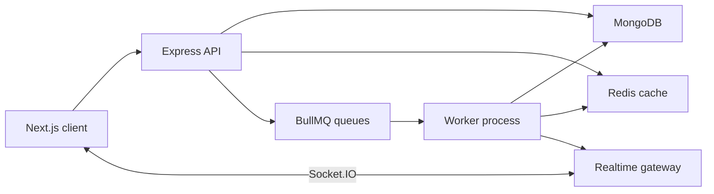
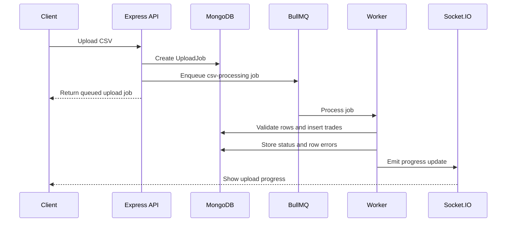
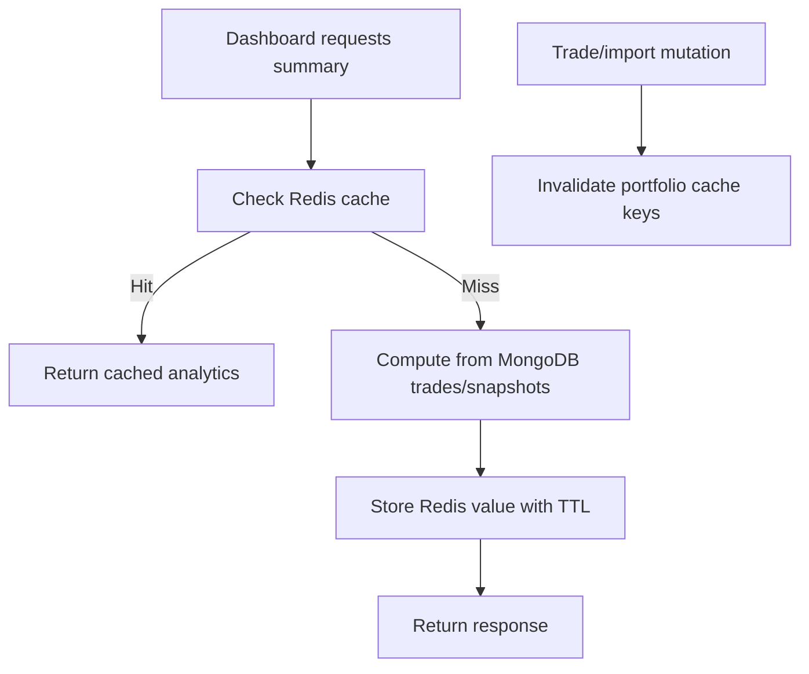
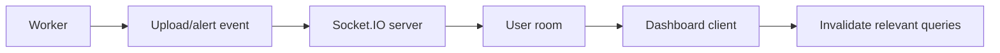
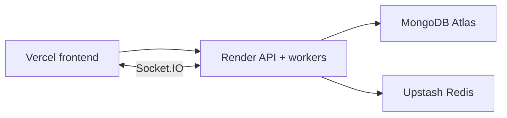

# RiskLens

Portfolio analytics and risk-alert workspace for importing trades, tracking holdings, monitoring risk, and reviewing portfolio activity.

RiskLens is a full-stack TypeScript application built with a separate Next.js frontend, Express API, MongoDB persistence, Redis caching, BullMQ workers, Socket.IO realtime updates, and production-oriented documentation.

## Live Deployment

| Service | URL |
| --- | --- |
| Web app | https://risklens-client.vercel.app |
| API health | https://risklens-api-qn0e.onrender.com/health |
| API docs | https://risklens-api-qn0e.onrender.com/api-docs |
| OpenAPI JSON | https://risklens-api-qn0e.onrender.com/openapi.json |

> Render free instances can sleep after inactivity. The first API request after a cold start can be slower.

## Table of Contents

- [Product Overview](#product-overview)
- [Core Features](#core-features)
- [Tech Stack](#tech-stack)
- [System Architecture](#system-architecture)
- [Backend Architecture](#backend-architecture)
- [Frontend Architecture](#frontend-architecture)
- [Queue Architecture](#queue-architecture)
- [Redis Caching Strategy](#redis-caching-strategy)
- [Realtime Flow](#realtime-flow)
- [Database Schema Summary](#database-schema-summary)
- [API Documentation](#api-documentation)
- [Docker Local Setup](#docker-local-setup)
- [Manual Local Setup](#manual-local-setup)
- [Environment Variables](#environment-variables)
- [Performance and Load Testing](#performance-and-load-testing)
- [Deployment Guide](#deployment-guide)
- [Engineering Decisions](#engineering-decisions)
- [Known Limitations](#known-limitations)
- [Future Improvements](#future-improvements)

## Product Overview

RiskLens helps a user turn trade history into a structured portfolio workspace. Users can create portfolios, add trades manually, upload CSV files, review holdings and P&L, monitor risk metrics, configure alerts, receive notifications, and run basic strategy backtests.

The project is intentionally not a trading bot. It does not place orders, connect to brokers, or claim strategy profitability. It focuses on portfolio recordkeeping, analytics, asynchronous data ingestion, and risk visibility.

## Core Features

| Area | Capabilities |
| --- | --- |
| Authentication | Register, login, logout, HTTP-only JWT cookies, protected routes |
| Portfolios | Create, list, update, delete, select active workspace |
| Trades | Manual trade entry, paginated trade history, oversell prevention |
| CSV imports | Header validation, row validation, duplicate detection, async BullMQ processing |
| Analytics | Holdings, allocation, realized P&L, unrealized P&L, returns, risk metrics |
| Alerts | Daily loss, max drawdown, concentration, and volatility thresholds |
| Notifications | Realtime and persisted notification feed with read/unread state |
| Backtesting | Buy-and-hold and moving-average crossover strategy results |
| Operations | Admin runtime metrics and queue observability |

## Tech Stack

| Layer | Technology |
| --- | --- |
| Frontend | Next.js App Router, React, TypeScript |
| UI | Tailwind CSS, Recharts, Lucide React |
| Server state | TanStack Query |
| Forms and validation | React Hook Form, Zod |
| Backend | Node.js, Express.js, TypeScript |
| Database | MongoDB, Mongoose |
| Authentication | JWT access tokens, refresh sessions, HTTP-only cookies, bcrypt |
| Cache | Redis / Upstash Redis |
| Queues | BullMQ |
| Realtime | Socket.IO |
| Logging | Pino structured logging |
| Deployment | Vercel, Render, MongoDB Atlas, Upstash Redis |

## System Architecture



RiskLens is a modular monolith. The product has one related domain, so the backend is kept in one deployable codebase with clear module boundaries rather than premature microservices.

## Backend Architecture

The Express API is organized around feature modules:

```text
server/src/
  modules/
    auth/
    portfolio/
    trades/
    uploads/
    analytics/
    alerts/
    notifications/
    backtests/
    activity/
    admin/
  queues/
  workers/
  middleware/
  sockets/
  utils/
```

Important backend practices:

- controller/service/model separation
- Zod request validation
- centralized error handling
- ownership checks on user-owned resources
- Redis cache invalidation after portfolio mutations
- BullMQ workers for long-running work
- Pino request and worker logs

## Frontend Architecture

The frontend uses Next.js App Router with dashboard routes under `client/app/dashboard`.

Important frontend practices:

- shared UI primitives for buttons, cards, inputs, labels, tables, and confirmation dialogs
- TanStack Query for server state, refetching, and cache invalidation
- clear loading, empty, and error states
- responsive dashboard shell with mobile navigation
- portfolio selector for portfolio-scoped pages
- professional user-facing copy only

## Queue Architecture



Queues used by the backend:

| Queue | Purpose |
| --- | --- |
| `csv-processing` | Validates uploaded CSV files and imports valid trade rows |
| `alert-evaluation` | Evaluates active risk alerts and creates notifications |
| `portfolio-snapshots` | Generates historical portfolio snapshots |
| `analytics-warmup` | Warms cache entries for frequently read analytics |

Queue observability:

```text
GET /api/v1/admin/queues
```

This endpoint is admin-protected and returns queue counts, active jobs, and recent failures.

## Redis Caching Strategy



RiskLens uses cache-aside caching for read-heavy analytics:

- portfolio summary
- holdings
- returns
- risk metrics
- market data responses

Cache entries use short TTLs and are invalidated after trade changes and CSV import completion.

## Realtime Flow



Socket.IO is used for upload progress, notifications, and dashboard synchronization. If realtime is unavailable, the UI still uses periodic query refetching for import history and dashboard data.

## Database Schema Summary

| Collection | Purpose |
| --- | --- |
| `users` | User identity, password hash, role |
| `sessions` | Refresh-token sessions |
| `portfolios` | User-owned portfolio workspaces |
| `trades` | Portfolio trade ledger |
| `uploadjobs` | CSV upload status, row counts, row errors |
| `portfoliosnapshots` | Historical portfolio value and return records |
| `alerts` | Risk thresholds configured by users |
| `notifications` | Alert/import/system notification feed |
| `activitylogs` | Audit-style activity timeline |
| `backtestresults` | Strategy run outputs and equity curves |
| `cachedanalyticsmetadata` | Cache observability metadata |

Important indexes include user ownership indexes, portfolio/date trade indexes, portfolio/symbol indexes, snapshot uniqueness, and idempotency keys for duplicate import protection.

## API Documentation

Interactive docs are served by the backend:

```text
http://localhost:5000/api-docs
http://localhost:5000/openapi.json
```

The repository also includes a Postman collection:

```text
docs/postman/RiskLens.postman_collection.json
```

Important route groups:

| Group | Routes |
| --- | --- |
| Auth | `/auth/register`, `/auth/login`, `/auth/me`, `/auth/logout` |
| Portfolios | `/portfolios`, `/portfolios/:portfolioId` |
| Trades | `/portfolios/:portfolioId/trades`, `/trades/:tradeId` |
| Uploads | `/portfolios/:portfolioId/trades/upload`, `/uploads`, `/uploads/:uploadJobId` |
| Analytics | `/summary`, `/holdings`, `/risk`, `/returns`, `/pnl` under portfolio routes |
| Alerts | `/portfolios/:portfolioId/alerts`, `/alerts/:alertId` |
| Notifications | `/notifications`, `/notifications/:notificationId/read` |
| Backtests | `/backtests`, `/backtests/:backtestId` |
| Admin | `/admin/metrics`, `/admin/queues` |

## Docker Local Setup

Copy the safe Docker environment example:

```bash
cp .env.docker.example .env.docker
```

Start the full local stack:

```bash
docker compose up --build
```

Services:

| Service | URL |
| --- | --- |
| Client | http://localhost:3000 |
| API | http://localhost:5000 |
| API docs | http://localhost:5000/api-docs |
| MongoDB | mongodb://localhost:27017/risklens |
| Redis | redis://localhost:6379 |

Useful Docker commands:

```bash
docker compose logs -f server
docker compose logs -f worker
docker compose ps
docker compose down
docker compose down -v
```

`docker compose down -v` removes local MongoDB and Redis volumes.

## Manual Local Setup

Install dependencies:

```bash
npm install
```

Create local env files from examples:

```text
server/.env
client/.env.local
```

Run processes separately:

```bash
npm run dev:server
npm run dev:workers
npm run dev:client
```

Or run the local dev orchestrator:

```bash
npm run dev
```


## Environment Variables

Server examples:

```text
server/.env.example
server/.env.production.example
.env.docker.example
```

Client examples:

```text
client/.env.example
client/.env.production.example
```

Important server variables:

| Variable | Purpose |
| --- | --- |
| `MONGODB_URI` | MongoDB connection string |
| `REDIS_URL` | Redis or Upstash URL |
| `JWT_SECRET` | JWT signing secret; use 32+ characters in production |
| `CLIENT_URL` | Primary allowed frontend origin |
| `CLIENT_URLS` | Optional comma-separated additional frontend origins |
| `SERVER_URL` | Public API URL |
| `COOKIE_SAME_SITE` | `lax` locally, `none` for cross-site Vercel/Render cookies |
| `MARKET_DATA_PROVIDER` | `fallback` or `alpha_vantage` |
| `ALPHA_VANTAGE_API_KEY` | Optional market data provider key |

Important client variables:

| Variable | Purpose |
| --- | --- |
| `NEXT_PUBLIC_API_URL` | API base URL, for example `https://risklens-api-qn0e.onrender.com/api/v1` |
| `NEXT_PUBLIC_SOCKET_URL` | Socket server URL, for example `https://risklens-api-qn0e.onrender.com` |

Do not commit real secrets.

## Performance and Load Testing

Benchmark portfolio summary caching:

```bash
npm run benchmark:summary
```

The benchmark writes real measurements to:

```text
docs/performance.md
```

Run the lightweight load test:

```bash
npm run loadtest:summary
```

Default target:

```text
http://localhost:5000/health
```

Customize target, duration, and concurrency:

```bash
LOADTEST_URL=http://localhost:5000/health LOADTEST_DURATION_SECONDS=20 LOADTEST_CONCURRENCY=10 npm run loadtest:summary
```

For authenticated endpoints, pass headers manually:

```bash
LOADTEST_URL=http://localhost:5000/api/v1/portfolios/<portfolioId>/summary LOADTEST_HEADERS_JSON='{"authorization":"Bearer <token>"}' npm run loadtest:summary
```

Load test results are written to:

```text
docs/load-testing.md
```

Local benchmark and load-test results are environment-specific. They are useful for comparing changes on the same setup, not for making universal production claims.

## Deployment Guide



Current free-tier deployment:

| Layer | Target |
| --- | --- |
| Frontend | Vercel |
| API + workers | Render web service |
| Database | MongoDB Atlas |
| Redis | Upstash Redis |

Production notes:

- Vercel project root should be `client`.
- Render build command should install dev dependencies before compiling TypeScript.
- Render start command for free single-service deployment: `npm run start:render --workspace server`.
- For a stronger production setup, deploy the worker as a separate long-running service.
- Set `CLIENT_URL=https://risklens-client.vercel.app` on the API.
- Set `NEXT_PUBLIC_API_URL=https://risklens-api-qn0e.onrender.com/api/v1` on the client.
- Set `NEXT_PUBLIC_SOCKET_URL=https://risklens-api-qn0e.onrender.com` on the client.
- Use `COOKIE_SAME_SITE=none` for Vercel + Render cross-site cookies.
- Keep `COOKIE_DOMAIN` empty unless both services share a parent custom domain.
- Rotate any development secrets before production use.

## Engineering Decisions

| Decision | Reason |
| --- | --- |
| Modular monolith | One related product domain with clear module boundaries and lower operational complexity |
| Separate Express API | Clear backend API, middleware, workers, sockets, and service-layer ownership |
| BullMQ workers | CSV imports, snapshots, and alert evaluation should not block HTTP requests |
| Redis cache-aside | Dashboard analytics are read-heavy and benefit from short-lived cached results |
| Server-side CSV validation | Client-side checks are helpful but not trusted for data integrity |
| HTTP-only cookies | Reduces direct token exposure compared with localStorage |
| Socket.IO | Provides realtime upload and notification feedback while retaining fallback HTTP refetching |

## Known Limitations

- Free Render deployments can cold start after inactivity.
- Current free deployment runs API and workers in one service; a separate worker service is better for production isolation.
- Market data can fall back to deterministic pricing when the configured provider is unavailable, and the UI labels those values as fallback data.
- Load-test and benchmark results are local/staging indicators, not universal production guarantees.
- Swagger UI uses CDN assets on the `/api-docs` page; `/openapi.json` remains available without CDN assets.

## Future Improvements

- Separate API and worker deployments.
- Object storage for uploaded CSV files.
- Dead-letter queue view for failed imports.
- Persistent metrics storage for longer historical observability.
- More granular role-based admin permissions.
- Stronger market data provider abstraction and data-source labeling in every analytics response.
- Optional custom domain so frontend and backend can share a parent domain.

## Manual Verification Checklist

1. Start Docker Compose or local dev processes.
2. Open `http://localhost:3000`.
3. Register or log in.
4. Create a portfolio.
5. Upload a CSV file with `date,symbol,side,quantity,price,fees` columns.
6. Confirm worker logs show CSV processing.
7. Confirm trades appear.
8. Confirm holdings and analytics update.
9. Confirm import history appears.
10. Create an alert.
11. Confirm notifications display after worker evaluation.
12. Run a backtest.
13. Open `http://localhost:5000/api-docs`.
14. Check `GET /api/v1/admin/queues` with an admin account.
15. Run `npm run benchmark:summary`.
16. Run `npm run loadtest:summary`.

## Quality Commands

```bash
npm run lint
npm run build
```

No testing work was added as part of this documentation and production-readiness pass.

## License

MIT License.
