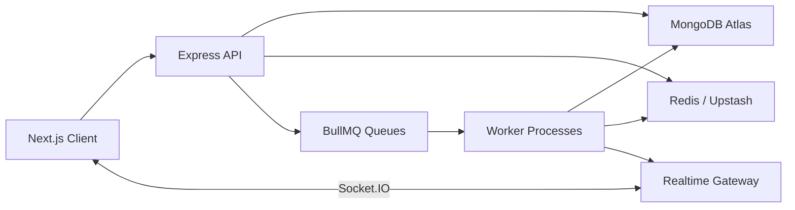
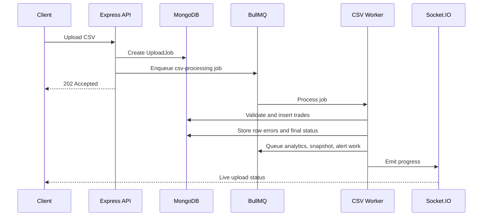

# RiskLens

**Portfolio Analytics & Risk Alert Platform**

RiskLens is a full-stack TypeScript portfolio analytics platform for ingesting trades, calculating holdings and risk metrics, processing CSV imports asynchronously, and delivering realtime portfolio notifications.

It is built as a production-style fintech SaaS application with a separate Next.js frontend, Express API, MongoDB persistence, Redis caching, BullMQ workers, Socket.IO realtime updates, and structured observability.

---

## Table Of Contents

- [Features](#features)
- [Tech Stack](#tech-stack)
- [Architecture](#architecture)
- [Demo Flow](#demo-flow)
- [Sample Data](#sample-data)
- [Local Development](#local-development)
- [Environment Variables](#environment-variables)
- [API Overview](#api-overview)
- [Database Design](#database-design)
- [Analytics Formulas](#analytics-formulas)
- [Performance](#performance)
- [Deployment Notes](#deployment-notes)
- [Engineering Decisions](#engineering-decisions)
- [Project Structure](#project-structure)

---

## Features

### Portfolio Workspace

- Authenticated portfolio workspaces
- Portfolio creation, listing, updates, and deletion
- Manual trade entry with oversell prevention
- Recent trade history and holdings tables
- Activity feed for portfolio changes, imports, alerts, and backtests

### CSV Import Pipeline

- CSV uploads with required columns: `date`, `symbol`, `side`, `quantity`, `price`, `fees`
- Header validation, row-level validation, duplicate-row detection, and partial failure support
- BullMQ-backed async processing instead of blocking API requests
- Redis-backed queue state and websocket progress updates
- Import history page showing queued, processing, completed, failed, and partially imported uploads

### Analytics

- Holdings and allocation
- Average buy price
- Market value
- Realized and unrealized P&L
- Portfolio summary
- Daily returns from portfolio snapshots
- Risk score, volatility, annualized volatility, Sharpe ratio, max drawdown, historical VaR 95, and concentration risk

### Alerts And Notifications

- Risk alerts for daily loss, drawdown, concentration, and volatility
- Background alert evaluation worker
- Realtime notifications with unread/read state
- Alert create/delete flow

### Backtesting

- Buy-and-hold strategy
- Moving-average crossover strategy
- Final capital, return, max drawdown, Sharpe ratio, trade count, win rate, and equity curve output

### Operations

- Admin-only metrics page
- API latency samples
- Redis cache hit ratio
- Queue job counts
- Failed upload count
- Active alerts and unread notifications

---

## Tech Stack

| Area | Stack |
| --- | --- |
| Frontend | Next.js App Router, React, TypeScript |
| UI | Tailwind CSS, Lucide React, Recharts |
| Server State | TanStack Query |
| Forms | React Hook Form, Zod |
| Backend | Node.js, Express.js, TypeScript |
| Database | MongoDB, Mongoose |
| Authentication | JWT access tokens, refresh-token sessions, HttpOnly cookies, bcrypt |
| Cache | Redis / Upstash Redis |
| Queues | BullMQ |
| Realtime | Socket.IO |
| Logging | Pino structured logging |
| Deployment Targets | Vercel, Render/Railway/Fly/Koyeb, MongoDB Atlas, Upstash Redis |

---

## Architecture



RiskLens uses a modular monolith. The backend is separated into clear modules for auth, portfolios, trades, uploads, analytics, alerts, notifications, snapshots, backtests, activity logs, admin metrics, queues, workers, and sockets.

### CSV Processing Flow



---

## Demo Flow

Use this path to verify the product locally:

1. Register or log in.
2. Open `Dashboard -> Portfolios`.
3. Click `Load sample portfolio`, or create a portfolio manually.
4. Open the portfolio detail page.
5. Upload [`docs/sample-portfolio.csv`](docs/sample-portfolio.csv).
6. Keep the worker process running so the CSV job can be processed.
7. Confirm imports appear in `Dashboard -> Imports`.
8. Confirm trades, holdings, P&L, allocation, risk metrics, and activity update.
9. Create an alert from `Dashboard -> Alerts`.
10. Confirm notifications appear after alert evaluation.
11. Run a backtest from `Dashboard -> Backtest`.

The sample portfolio loader creates a professional portfolio with sample trades, snapshots, alerts, activity, and a notification so the dashboard can be reviewed immediately.

---

## Sample Data

The repository includes a CSV file that matches the supported upload format:

```text
docs/sample-portfolio.csv
```

Required CSV columns:

```csv
date,symbol,side,quantity,price,fees
```

The import parser tolerates UTF-8 BOM characters, trailing blank lines, and a harmless trailing empty column caused by a trailing comma.

---

## Local Development

### Prerequisites

- Node.js 20.11+ or 22+
- npm 10+
- MongoDB Atlas or local MongoDB
- Redis or Upstash Redis

### Install

```bash
npm install
```

### Run Locally

Run all local processes:

```bash
npm run dev
```

Or run each process separately:

```bash
npm run dev:server
npm run dev:workers
npm run dev:client
```

The worker process is required for async CSV import processing, snapshots, alert evaluation, and analytics warmup.

### Seed Data

```bash
npm run seed
```

Seeded admin account:

```text
demo@risklens.dev
risklens123
```

---

## Environment Variables

Create these files:

```text
server/.env
client/.env.local
```

Use the examples as templates:

```text
server/.env.example
client/.env.example
```

Important server variables:

| Variable | Purpose |
| --- | --- |
| `MONGODB_URI` | MongoDB connection string |
| `REDIS_URL` | Redis or Upstash Redis URL |
| `JWT_SECRET` | Access-token signing secret |
| `JWT_EXPIRES_IN` | Access token lifetime |
| `REFRESH_TOKEN_SECRET` | Refresh-token signing secret |
| `CLIENT_URL` | Frontend origin |
| `CLIENT_URLS` | Optional comma-separated allowed origins |
| `ALPHA_VANTAGE_API_KEY` | Optional market data provider key |

Important client variable:

| Variable | Purpose |
| --- | --- |
| `NEXT_PUBLIC_API_URL` | Backend API base URL, for example `http://localhost:5000/api/v1` |
| `NEXT_PUBLIC_SOCKET_URL` | Backend socket URL, for example `http://localhost:5000` |

---

## API Overview

Base path:

```text
/api/v1
```

### Auth

| Method | Route |
| --- | --- |
| POST | `/auth/register` |
| POST | `/auth/login` |
| POST | `/auth/refresh` |
| POST | `/auth/logout` |
| GET | `/auth/me` |

### Demo

| Method | Route | Purpose |
| --- | --- | --- |
| POST | `/demo/sample-portfolio` | Create or refresh the authenticated user's sample portfolio |

### Portfolios And Trades

| Method | Route |
| --- | --- |
| POST | `/portfolios` |
| GET | `/portfolios` |
| GET | `/portfolios/:portfolioId` |
| PUT | `/portfolios/:portfolioId` |
| DELETE | `/portfolios/:portfolioId` |
| POST | `/portfolios/:portfolioId/trades` |
| GET | `/portfolios/:portfolioId/trades` |
| PUT | `/trades/:tradeId` |
| DELETE | `/trades/:tradeId` |

### Uploads

| Method | Route |
| --- | --- |
| POST | `/portfolios/:portfolioId/trades/upload` |
| GET | `/uploads` |
| GET | `/uploads/:uploadJobId` |

### Analytics

| Method | Route |
| --- | --- |
| GET | `/portfolios/:portfolioId/summary` |
| GET | `/portfolios/:portfolioId/holdings` |
| GET | `/portfolios/:portfolioId/returns` |
| GET | `/portfolios/:portfolioId/risk` |
| GET | `/portfolios/:portfolioId/pnl` |

### Alerts, Notifications, Backtests

| Method | Route |
| --- | --- |
| POST | `/portfolios/:portfolioId/alerts` |
| GET | `/portfolios/:portfolioId/alerts` |
| PUT | `/alerts/:alertId` |
| DELETE | `/alerts/:alertId` |
| GET | `/notifications` |
| PUT | `/notifications/:notificationId/read` |
| POST | `/backtests` |
| GET | `/backtests` |
| GET | `/backtests/:backtestId` |

### Admin

| Method | Route | Access |
| --- | --- | --- |
| GET | `/admin/metrics` | Admin only |

---

## Database Design

| Collection | Purpose |
| --- | --- |
| `users` | Identity, email, password hash, role |
| `sessions` | Refresh-token sessions |
| `portfolios` | User-owned portfolio containers |
| `trades` | Portfolio trade ledger |
| `uploadjobs` | CSV job status, row counts, and row errors |
| `portfoliosnapshots` | Historical portfolio values and daily returns |
| `alerts` | User-defined risk thresholds |
| `notifications` | Realtime notification inbox |
| `activitylogs` | Audit-style activity feed |
| `backtestresults` | Stored backtest outputs |
| `cachedanalyticsmetadata` | Cache observability metadata |

Important indexes:

- unique user email
- user + portfolio ownership indexes
- portfolio + symbol trade lookup
- portfolio + trade date sorting
- portfolio + idempotency key for duplicate import protection
- portfolio + date unique snapshot index
- user + portfolio + active alert lookup

---

## Analytics Formulas

Daily return:

```text
dailyReturn = (valueToday - valueYesterday) / valueYesterday
```

Volatility:

```text
volatility = standardDeviation(dailyReturns)
```

Annualized volatility:

```text
annualizedVolatility = dailyVolatility * sqrt(252)
```

Sharpe ratio:

```text
sharpeRatio = averageReturn / volatility
```

Max drawdown:

```text
drawdown = (currentValue - previousPeak) / previousPeak
```

Historical VaR 95:

```text
VaR95 = absolute value of the 5th percentile daily return
```

Risk score:

```text
riskScore =
  30 * normalizedVolatility +
  30 * normalizedDrawdown +
  20 * concentrationRisk +
  20 * normalizedVaR
```

---

## Performance

RiskLens uses Redis cache-aside caching for read-heavy analytics:

- portfolio summary
- holdings
- returns
- risk metrics
- market data

Cache invalidation runs after trade creation, trade updates, trade deletion, and CSV import completion.

Benchmark command:

```bash
npm run benchmark:summary
```

Latest recorded local benchmark:

| Scenario | Average | p95 | Min | Max |
| --- | ---: | ---: | ---: | ---: |
| Cold cache | 2083.74 ms | 2181.2 ms | 936.46 ms | 20802.94 ms |
| Warm Redis cache | 523.29 ms | 558.53 ms | 484.76 ms | 562.23 ms |

Full benchmark notes are stored in [`docs/performance.md`](docs/performance.md). Regenerate this file after changing infrastructure, cache settings, or analytics code.

---

## Deployment Notes

Planned deployment topology:

| Layer | Recommended Target |
| --- | --- |
| Frontend | Vercel |
| API | Render, Railway, Fly.io, or Koyeb |
| Worker | Separate backend worker service |
| Database | MongoDB Atlas |
| Redis | Upstash Redis |

Production notes:

- API and workers must use the same MongoDB and Redis instances.
- Deploy the worker as a separate long-running process.
- `CLIENT_URL` and `CLIENT_URLS` must include deployed frontend origins.
- Use secure cookies and `COOKIE_SAME_SITE=none` for cross-site frontend/backend deployments.
- Rotate all local development secrets before deployment.

---

## Engineering Decisions

### Modular Monolith

The backend uses a modular monolith because the product domain is tightly related and does not require separate services yet. The module boundaries keep the codebase understandable while leaving room for future service extraction.

### BullMQ Workers

CSV imports, snapshots, alert evaluation, and cache warmup are handled outside the request lifecycle so API requests stay responsive.

### Redis Caching

Portfolio summaries and risk calculations are read-heavy and computation-heavy. Redis reduces repeated analytics work and improves dashboard responsiveness.

### Server-Side CSV Validation

CSV files are validated on the backend because client-side validation cannot be trusted. The worker stores row-level errors and supports partial failure handling.

### Cookie-Based Auth

Access tokens are stored in HttpOnly cookies instead of localStorage to reduce token exposure risk.

---

## Project Structure

```text
risklens-portfolio-analytics/
  client/
    app/
    components/
    hooks/
    lib/
    types/
  server/
    src/
      config/
      middleware/
      modules/
      queues/
      sockets/
      utils/
      workers/
  docs/
    performance.md
    sample-portfolio.csv
  scripts/
  README.md
```

---

## Manual Verification Commands

Run these before pushing or deploying:

```bash
npm run lint
npm run build
npm test
```

---

## Repository

GitHub: [SriHarshaRajuY/RiskLens](https://github.com/SriHarshaRajuY/RiskLens)

---

## License

MIT License
