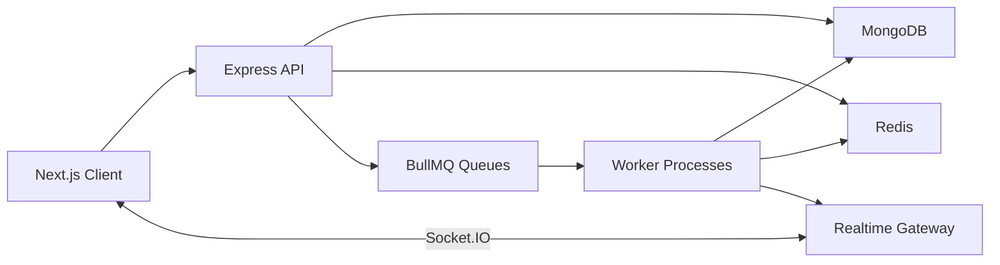
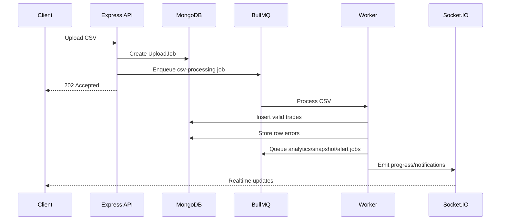

# RiskLens

**Portfolio Analytics & Risk Alert Platform**

RiskLens is a full-stack TypeScript SaaS-style application for tracking trades, calculating portfolio analytics, monitoring risk, processing CSV uploads asynchronously, and delivering realtime risk notifications.

The project is intentionally designed as a **software-engineering-heavy fintech analytics platform**, not a trading bot or HFT simulator.

---

## Why This Project Exists

Most portfolio trackers are either simple spreadsheets or frontend-only dashboards. RiskLens focuses on the backend and system-design work behind a real analytics product:

- authenticated multi-user portfolio management
- trade ingestion and validation
- async CSV processing
- portfolio holdings and P&L calculations
- Redis-backed analytics caching
- BullMQ background workers
- realtime notifications
- risk alert evaluation
- observability and request tracing

This makes the project useful for demonstrating backend design, API architecture, database modeling, caching, queues, realtime systems, and applied quantitative analytics in SDE internship interviews.

---

## Tech Stack

| Area | Stack |
| --- | --- |
| Frontend | Next.js App Router, React, TypeScript |
| UI | Tailwind CSS, Radix-style primitives, Lucide React, Recharts |
| Server State | TanStack Query |
| Forms | React Hook Form, Zod |
| Backend | Node.js, Express.js, TypeScript |
| Database | MongoDB, Mongoose |
| Auth | JWT access tokens, refresh-token sessions, HttpOnly cookies, bcrypt |
| Cache | Redis / Upstash Redis |
| Queues | BullMQ |
| Realtime | Socket.IO |
| Logging | Pino structured logging |
| Deployment Targets | Vercel, Render/Koyeb/Railway, MongoDB Atlas, Upstash Redis |

---

## Core Features

### Authentication & Security

- Register, login, logout, refresh session, and current-user APIs
- HttpOnly cookie-based authentication
- Refresh-token session storage with revocation support
- Password hashing with bcrypt
- CSRF protection for unsafe requests
- Rate limiting for auth and API routes
- Ownership checks on user-scoped resources
- Admin-only metrics endpoint

### Portfolio Management

- Create and manage multiple portfolios
- Portfolio-level ownership validation
- Paginated portfolio APIs
- Portfolio summary dashboard

### Trade System

- Manual trade creation
- Trade history listing
- Buy/sell ledger reconstruction
- Oversell prevention
- Portfolio write locking for safer concurrent mutations
- CSV upload support

### Async CSV Processing

CSV uploads are queued instead of processed inside the request lifecycle.

Flow:

1. User uploads a CSV file.
2. API validates upload metadata.
3. Upload job is stored in MongoDB.
4. BullMQ job is queued.
5. Worker validates rows.
6. Valid trades are inserted in batches.
7. Invalid rows are recorded with row-level errors.
8. Cache warmup, snapshot generation, and alert evaluation jobs are triggered.

Supported CSV format:

```csv
date,symbol,side,quantity,price,fees
2025-01-01,AAPL,BUY,10,180,1.50
2025-01-10,AAPL,SELL,4,195,1.00
2025-01-15,MSFT,BUY,5,410,1.25
```

### Analytics Engine

RiskLens calculates:

- current holdings
- average buy price
- market value
- realized P&L
- unrealized P&L
- total P&L
- allocation percentage
- portfolio summary
- daily returns

### Risk Engine

Risk metrics include:

- volatility
- annualized volatility
- Sharpe ratio
- max drawdown
- historical VaR 95
- concentration risk
- custom risk score

### Alerts & Notifications

Users can create alerts for:

- daily loss
- max drawdown
- concentration risk
- volatility

Workers evaluate active alerts and create realtime dashboard notifications when thresholds are breached.

### Backtesting

RiskLens includes a small backtesting module for interview-friendly quant relevance:

- buy and hold
- moving-average crossover

Backtest output includes:

- final capital
- total return
- Sharpe ratio
- max drawdown
- number of trades
- win rate
- equity curve

---

## System Architecture



RiskLens is built as a **modular monolith**. This keeps the project deployable and understandable while still separating the main domains:

- auth
- portfolios
- trades
- uploads
- analytics
- alerts
- notifications
- snapshots
- backtests
- activity logs
- admin metrics

This is a deliberate design choice. The system does not need microservices at this scale, but the module boundaries make future service extraction possible.

---

## Queue Architecture



Queues:

| Queue | Purpose |
| --- | --- |
| `csv-processing` | Validates and imports uploaded trades |
| `alert-evaluation` | Evaluates active risk alerts |
| `portfolio-snapshots` | Stores daily portfolio values |
| `analytics-warmup` | Precomputes cache-heavy analytics |

---

## Database Design

| Collection | Purpose |
| --- | --- |
| `users` | User identity, email, hashed password, role |
| `sessions` | Refresh-token session records |
| `portfolios` | User-owned portfolio containers |
| `trades` | Portfolio trade ledger |
| `uploadjobs` | CSV upload status, row counts, row errors |
| `portfoliosnapshots` | Historical portfolio values |
| `alerts` | User-defined risk thresholds |
| `notifications` | Dashboard notifications |
| `activitylogs` | Audit-style product activity feed |
| `backtestresults` | Stored backtest outputs |
| `cachedanalyticsmetadata` | Cache observability metadata |

Important indexes include:

- unique user email
- user + portfolio ownership indexes
- portfolio + symbol trade lookup
- portfolio + trade date sorting
- portfolio + idempotency key for CSV imports
- portfolio + date unique snapshot index
- active alert lookup indexes

---

## API Overview

Base path:

```text
/api/v1
```

### Auth

| Method | Route |
| --- | --- |
| POST | `/auth/register` |
| POST | `/auth/login` |
| POST | `/auth/refresh` |
| POST | `/auth/logout` |
| GET | `/auth/me` |

### Portfolios

| Method | Route |
| --- | --- |
| POST | `/portfolios` |
| GET | `/portfolios` |
| GET | `/portfolios/:portfolioId` |
| PUT | `/portfolios/:portfolioId` |
| DELETE | `/portfolios/:portfolioId` |

### Trades

| Method | Route |
| --- | --- |
| POST | `/portfolios/:portfolioId/trades` |
| GET | `/portfolios/:portfolioId/trades` |
| PUT | `/trades/:tradeId` |
| DELETE | `/trades/:tradeId` |
| POST | `/portfolios/:portfolioId/trades/upload` |
| GET | `/uploads/:uploadJobId` |

### Analytics

| Method | Route |
| --- | --- |
| GET | `/portfolios/:portfolioId/summary` |
| GET | `/portfolios/:portfolioId/holdings` |
| GET | `/portfolios/:portfolioId/returns` |
| GET | `/portfolios/:portfolioId/risk` |
| GET | `/portfolios/:portfolioId/pnl` |

### Alerts & Notifications

| Method | Route |
| --- | --- |
| POST | `/portfolios/:portfolioId/alerts` |
| GET | `/portfolios/:portfolioId/alerts` |
| PUT | `/alerts/:alertId` |
| DELETE | `/alerts/:alertId` |
| GET | `/notifications` |
| PUT | `/notifications/:notificationId/read` |

### Backtests

| Method | Route |
| --- | --- |
| POST | `/backtests` |
| GET | `/backtests` |
| GET | `/backtests/:backtestId` |

### Admin

| Method | Route | Access |
| --- | --- | --- |
| GET | `/admin/metrics` | Admin only |

---

## Quant Formulas

Daily return:

```text
dailyReturn = (valueToday - valueYesterday) / valueYesterday
```

Volatility:

```text
volatility = standardDeviation(dailyReturns)
```

Annualized volatility:

```text
annualizedVolatility = dailyVolatility * sqrt(252)
```

Sharpe ratio:

```text
sharpeRatio = averageReturn / volatility
```

Max drawdown:

```text
drawdown = (currentValue - previousPeak) / previousPeak
```

Historical VaR 95:

```text
VaR95 = absolute value of the 5th percentile daily return
```

Risk score:

```text
riskScore =
  30 * normalizedVolatility +
  30 * normalizedDrawdown +
  20 * concentrationRisk +
  20 * normalizedVaR
```

---

## Performance & Caching

RiskLens uses Redis cache-aside caching for read-heavy analytics endpoints:

- portfolio summary
- holdings
- returns
- risk metrics
- market data

Cache invalidation happens after:

- trade creation
- trade update
- trade deletion
- CSV import completion

The project also includes a benchmark script:

```bash
npm run benchmark:summary
```

Latest recorded local benchmark:

| Scenario | Average | p95 | Min | Max |
| --- | ---: | ---: | ---: | ---: |
| Cold cache | 2083.74 ms | 2181.2 ms | 936.46 ms | 20802.94 ms |
| Warm Redis cache | 523.29 ms | 558.53 ms | 484.76 ms | 562.23 ms |

Full benchmark notes are in [`docs/performance.md`](docs/performance.md).

---

## Local Development

### Prerequisites

- Node.js 22
- npm 10+
- MongoDB Atlas or local MongoDB
- Redis or Upstash Redis

### Install

```bash
npm install
```

### Environment Files

Create:

```text
server/.env
client/.env.local
```

Use the example files:

```text
server/.env.example
client/.env.example
```

### Run The App

Run all local services:

```bash
npm run dev
```

Or run each service separately:

```bash
npm run dev:server
npm run dev:workers
npm run dev:client
```

### Seed Demo Data

```bash
npm run seed
```

Demo account:

```text
demo@risklens.dev
risklens123
```

---

## Verification Commands

```bash
npm run build
npm run lint
npm test
```

These commands verify:

- backend TypeScript compilation
- frontend production build
- frontend linting
- backend type-checking
- server unit/integration tests

---

## Deployment Notes

Recommended deployment:

| Layer | Option |
| --- | --- |
| Frontend | Vercel |
| API | Render, Koyeb, Railway, or Fly.io |
| Workers | Separate backend worker service |
| Database | MongoDB Atlas |
| Redis | Upstash Redis |

Important production notes:

- API and workers should use the same MongoDB and Redis instances.
- `CLIENT_URL` and `CLIENT_URLS` must include deployed frontend origins.
- Use `COOKIE_SAME_SITE=none` for cross-site frontend/backend deployments.
- Rotate all local development secrets before deployment.
- Run API and workers as separate processes.

---

## Engineering Decisions

### Modular Monolith

RiskLens uses a modular monolith instead of microservices because the domain is tightly related and does not require separate service deployment yet. This keeps development and deployment practical while preserving clean boundaries.

### BullMQ Workers

CSV processing, snapshots, alert evaluation, and cache warmup can become long-running tasks. BullMQ keeps those workflows outside the request lifecycle.

### Redis Caching

Portfolio summaries and risk calculations are read-heavy and computation-heavy. Redis reduces repeated analytics work and improves dashboard responsiveness.

### Server-Side CSV Validation

CSV files are validated on the backend because client-side validation cannot be trusted. The worker stores row-level errors and supports partial failure handling.

### Cookie-Based Auth

Access tokens are stored in HttpOnly cookies instead of localStorage to reduce token theft risk from XSS.

---

## What This Project Demonstrates

RiskLens is designed to show:

- full-stack TypeScript development
- backend architecture
- REST API design
- MongoDB data modeling and indexing
- authentication and authorization
- async job processing
- Redis caching
- realtime notifications
- validation and error handling
- observability foundations
- frontend dashboard engineering
- applied quantitative analytics

---

## Future Improvements

- cursor pagination for large trade histories
- materialized holdings collection
- OpenTelemetry tracing
- Prometheus/Grafana metrics export
- object storage for larger CSV files
- organization/team workspaces
- email notification delivery
- richer admin dashboard
- Playwright end-to-end tests

---

## Repository

GitHub: [SriHarshaRajuY/RiskLens](https://github.com/SriHarshaRajuY/RiskLens)

---

## License

MIT License
